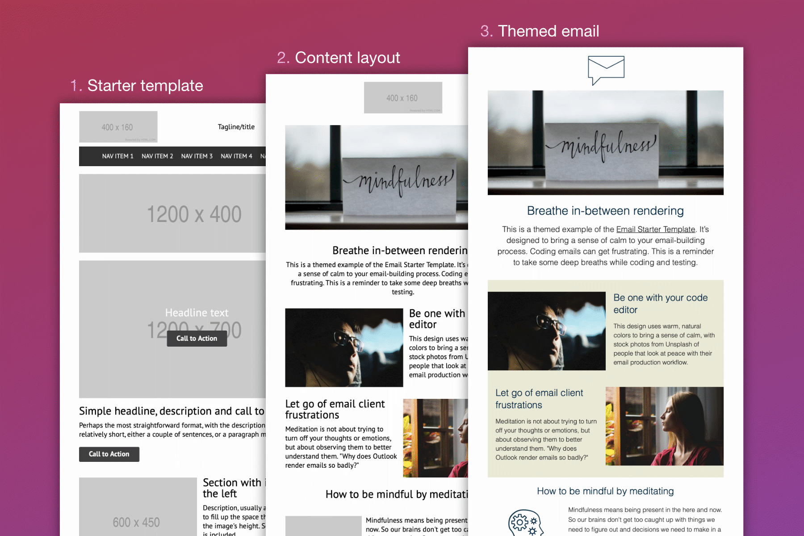
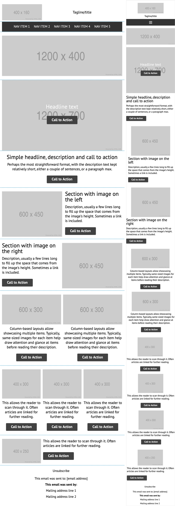

# Starter Email Template
### Standard components for designing and building emails

**Quickly kick off your email's design with a skeleton layout.** The Starter Email Template is a modular email template that acts as a prototype for your own email template. Its simple design focuses on essential layouts and components you would need in an email, with minimal styling for you to build on top of when theming your own template.

## Features ##
- Standard stackable sections and components
- Variant formatting options for sections
- Mobile-responsive ready
- Built semantically and with accessibility in mind
- Includes standard layout examples
- Includes example themed email
- Editable tags for Blocks Edit

## Contributing ##
The Starter Email Template is an open-source, community-driven project on GitHub. Help maintain it by submitting bug fixes, pull requests, or enhancements, or by participating in discussions in the issue tracker. And submit your themed templates and emails that you create from the base template.

## Build notes ##
- Structural code based on Mark Robbins' [Good Email Code](https://goodemailcode.com)
- Contains [Blocks Edit editable tags](https://blocksedit.com/developer/)

## Sections and mobile version ##

